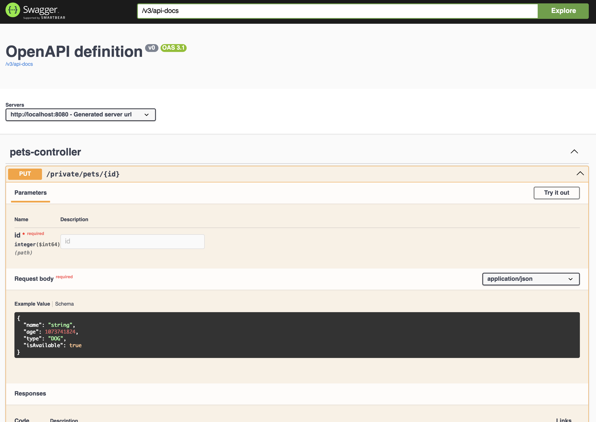

# API de Adopción de Mascotas

API REST desarrollada con Spring Boot para gestionar adopciones de mascotas,
creada durante el Bootcamp de Spring Boot de CódigoFacilito.

## 🚀 Descripción General

Esta API permite gestionar mascotas, usuarios y procesos de adopción en un
sistema de adopción de mascotas. Proporciona endpoints para crear, leer,
actualizar y eliminar mascotas, gestionar cuentas de usuario y procesar
solicitudes de adopción.

## 🛠️ Tecnologías Utilizadas

- Java 21
- Spring Boot 3.x
- Spring Security
- JPA/Hibernate
- Gradle
- JUnit 5
- Mockito

## 📋 Funcionalidades Principales

- Gestión de Mascotas (operaciones CRUD)
- Gestión de Usuarios
- Proceso de Adopción
- Autorización basada en Roles
- Manejo de Excepciones
- Pruebas Unitarias

## 🔐 Endpoints de la API

> Credenciales para las rutas privadas:
> user: "api-admin"
> pass: "!!4dm1n@api-adopcion"

### Rutas Públicas (`/api/public`)

#### Mascotas

- `GET /pets` - Listar todas las mascotas disponibles
- `GET /pets/{id}` - Obtener detalles de una mascota por ID

#### Usuarios

- `GET /users` - Listar todos los usuarios
- `GET /users/{username}` - Obtener detalles de usuario por nombre de usuario

#### Adopciones

- `GET /adoptions` - Listar todas las adopciones

### Rutas Privadas (`/api/private`)

#### Mascotas

- `POST /pets` - Crear nueva mascota
- `PUT /pets/{id}` - Actualizar datos de mascota
- `DELETE /pets/{id}` - Eliminar mascota

#### Usuarios

- `POST /users` - Crear nuevo usuario

#### Adopciones

- `POST /adoptions` - Crear nueva solicitud de adopción

## Rutas de Spring Actuator

- `GET /actuator/health` - Información sobre la salud de la aplicación

## Rutas de OpenAPI Swagger

- `/swagger-ui/index.html` - Página de documentación de la API con Swagger UI
- `/v3/api-docs` - Documentación de la API en formato JSON



## 🚀 Ejecutar el Proyecto

1. Clonar el repositorio

    ```bash
    git clone https://github.com/tuusuario/api-adopcion-codigofacilito.git
    ```

2. Navegar al directorio del proyecto
    ```bash 
    cd api-adopcion-codigofacilito 
    ```

4. Compilar el proyecto
    ```bash 
    ./gradlew build 
    ```

5. Ejecutar la aplicación
    ```bash
   ./gradlew bootRun
     ```

### La API estará disponible en http://localhost:8080

## 🧪 Ejecutar Pruebas

```bash
./gradlew bootTestRun
```

## 👨‍💻 Desarrollador

Desarrollado x Sebastián Kravetz

Proyecto desarrollado como parte del Bootcamp de Spring Boot de CódigoFacilito

## 🙏 Agradecimientos

CódigoFacilito por proporcionar el bootcamp
A todos los instructores y mentores involucrados en el proceso de aprendizaje
